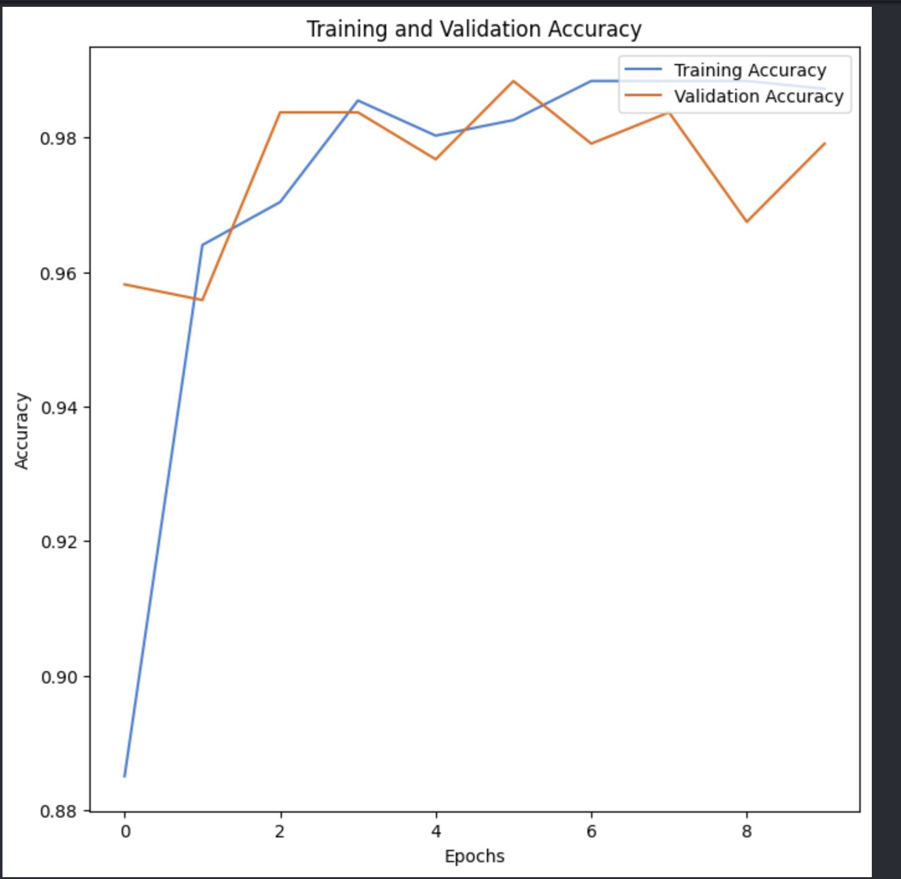
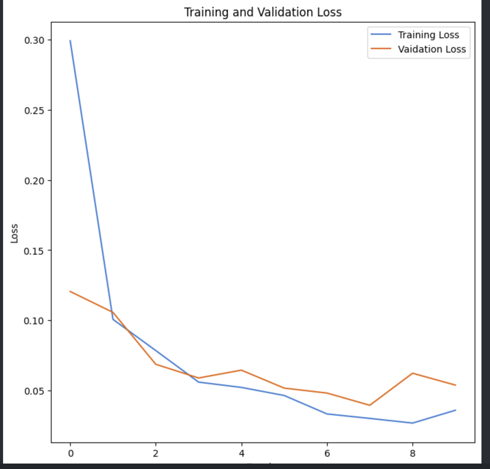

# Plant Disease Image Classifier

A deep learning-based image classification project that detects potato leaf diseases using a Convolutional Neural Network (CNN) built with TensorFlow and Keras.

The model classifies potato leaf images into three categories:

- Potato Early Blight
- Potato Late Blight
- Potato Healthy

The project also includes a Streamlit web application that allows users to upload plant leaf images and receive disease predictions with confidence scores.

---

## Demo

Users can upload potato leaf images and receive real-time disease predictions directly through the Streamlit interface.

---

## Features

- Image classification using CNNs
- TensorFlow/Keras deep learning pipeline
- Image preprocessing and normalization
- Data augmentation for improved generalization
- Training and validation accuracy/loss visualization
- Real-time prediction using Streamlit
- Confidence score visualization for predictions
- Upload custom leaf images for testing

---

## Technologies Used

- Python
- TensorFlow / Keras
- NumPy
- Matplotlib
- Pillow
- Streamlit

---

## Dataset

This project uses the PlantVillage dataset from Kaggle.

Dataset source:
https://www.kaggle.com/datasets/emmarex/plantdisease

For this version of the project, only the following potato classes were used:

- Potato\_\_\_Early_blight
- Potato\_\_\_Late_blight
- Potato\_\_\_healthy

---

## Model Architecture

The CNN architecture consists of:

- Data augmentation layers
  - RandomFlip
  - RandomRotation
  - RandomZoom
- Rescaling layer for normalization
- 3 Convolutional layers
- MaxPooling layers
- Flatten layer
- Dense hidden layer
- Softmax output layer

The model was trained using:

- Adam optimizer
- Sparse categorical crossentropy loss
- Accuracy metric

---

## Project Structure

```text
plant-image-classifier/
|
|-- datasets/
|-- model/
|   `-- plant_disease_model.keras
|
|-- notebooks/
|   `-- 01_data_check.ipynb
|
|-- images/
|   |-- prediction_results.png
|   |-- streamlitUI.png
|   |-- streamlitUI2.png
|   |-- training_and_validation_accuracy_graph.png
|   |-- training_and_validation_loss_graph.png
|   |-- transfer_learning_accuracy_graph.png
|   `-- transfer_learning_loss_graph.png
|
|-- app.py
|-- requirements.txt
|-- README.md
`-- .gitignore
```

---

## How to Run the Project

### 1. Clone the repository

```bash
git clone <your-repository-link>
cd plant-image-classifier
```

### 2. Create virtual environment

```bash
py -3.11 -m venv .venv
```

### 3. Activate environment

Windows PowerShell:

```powershell
.venv\Scripts\Activate.ps1
```

### 4. Install dependencies

```bash
pip install -r requirements.txt
```

### 5. Run the Streamlit app

```bash
python -m streamlit run app.py
```

---

## Model Performance

The final CNN model achieved approximately:

- ~95% training accuracy
- ~95% validation accuracy

Data augmentation was used to improve generalization and reduce overfitting.

The model was able to correctly identify most healthy and diseased potato leaves from unseen validation images.

---

## Version 2: Transfer Learning

After building the first custom CNN model, I improved the project using transfer learning with MobileNetV2.

MobileNetV2 was used as a pretrained feature extractor, and custom Dense layers were added for the 3 potato disease classes.

This version includes:

- MobileNetV2 pretrained on ImageNet
- Frozen base model layers
- Data augmentation
- Rescaling to match MobileNetV2 input format
- GlobalAveragePooling2D
- Dense classification head

---

## Model Comparison

| Model     | Approach                      | Validation Accuracy |
| --------- | ----------------------------- | ------------------- |
| Version 1 | Custom CNN                    | ~95%                |
| Version 2 | MobileNetV2 Transfer Learning | ~98%                |

---

## Note

The dataset and trained model file are not included in this repository due to GitHub file size limitations.

The dataset can be downloaded from Kaggle and the model can be trained locally using the provided notebook and scripts.

---

## Future Improvements

- Add more plant disease classes
- Fine-tune deeper MobileNetV2 layers for additional performance
- Expand support to additional plant diseases and crops
- Deploy the application online
- Add treatment recommendations for detected diseases

---

## Screenshots

### Streamlit Application UI


### Prediction Results


### Training Graphs

Version 1 custom CNN:


Version 2 MobileNetV2 transfer learning:





---

## Learning Outcomes

Through this project, I learned:

- CNN fundamentals
- Image preprocessing
- TensorFlow/Keras workflows
- Model evaluation and validation
- Deep learning inference pipelines
- Deploying ML applications using Streamlit
- Transfer Learning

---

## Key Concepts Explored

- Convolutional Neural Networks (CNNs)
- Image preprocessing and normalization
- Overfitting and validation
- Data augmentation
- Batch training
- Model inference pipelines
- Streamlit deployment
- Transfer Learning
