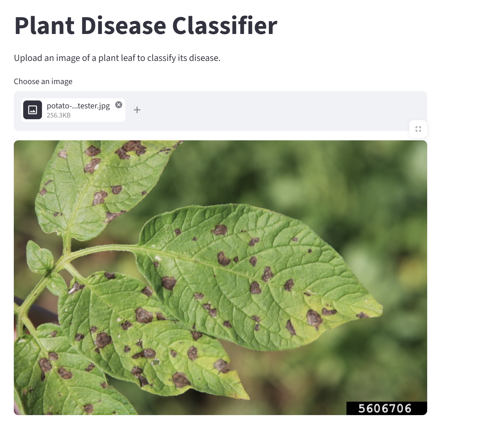
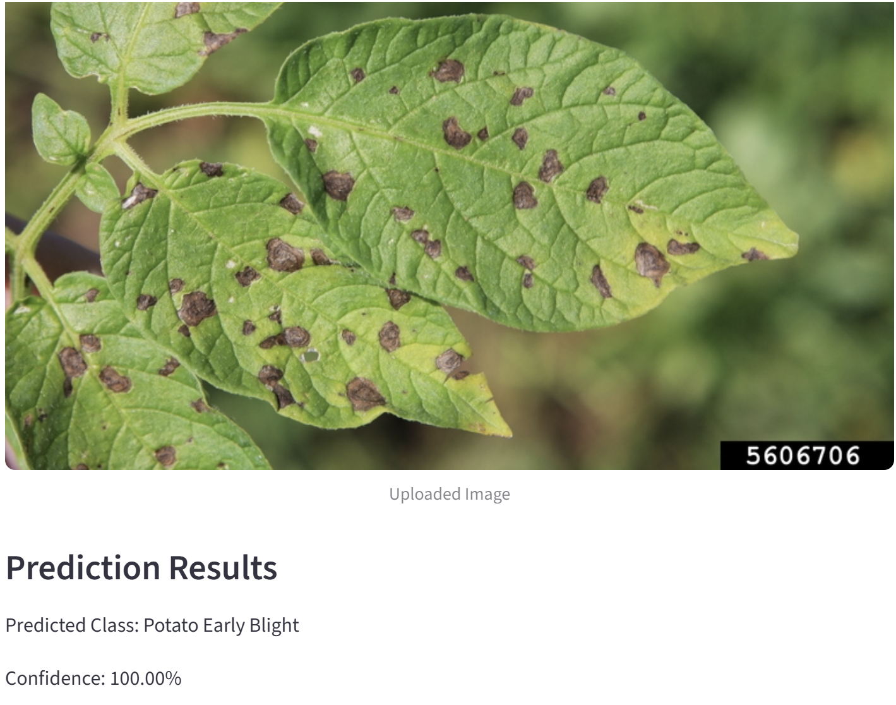
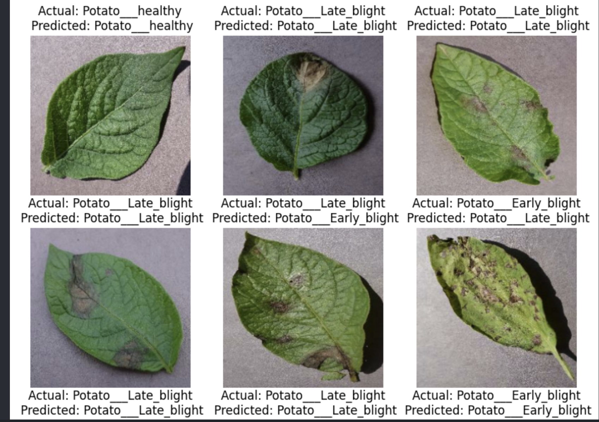
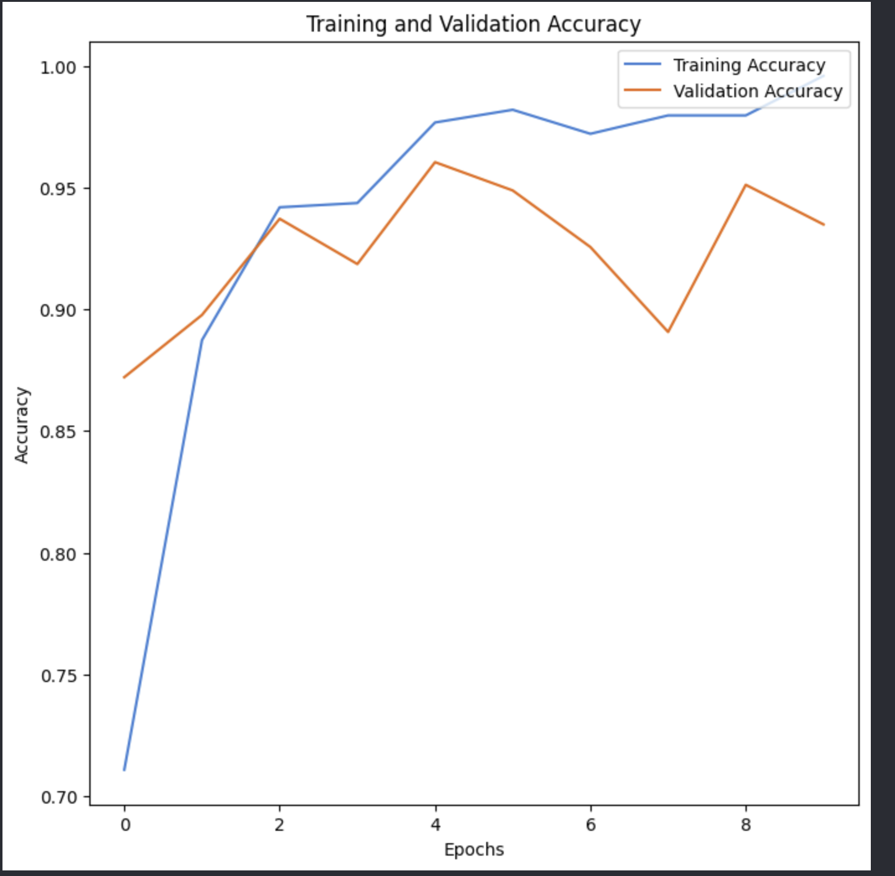
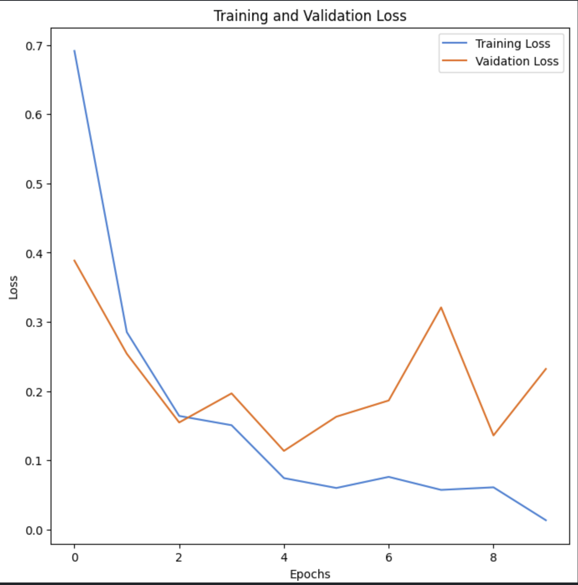

# Plant Disease Image Classifier

A deep learning-based image classification project that detects potato leaf diseases using a Convolutional Neural Network (CNN) built with TensorFlow and Keras.

The model classifies potato leaf images into three categories:

- Potato Early Blight
- Potato Late Blight
- Potato Healthy

The project also includes a Streamlit web application that allows users to upload plant leaf images and receive disease predictions with confidence scores.

---

## Features

- Image classification using CNNs
- TensorFlow/Keras deep learning pipeline
- Image preprocessing and normalization
- Training and validation accuracy visualization
- Real-time prediction using Streamlit
- Upload custom leaf images for testing

---

## Technologies Used

- Python
- TensorFlow / Keras
- NumPy
- Matplotlib
- Pillow
- Streamlit

---

## Dataset

This project uses the PlantVillage dataset from Kaggle.

Dataset source:
https://www.kaggle.com/datasets/emmarex/plantdisease

For this version of the project, only the following potato classes were used:

- Potato___Early_blight
- Potato___Late_blight
- Potato___healthy

---

## Model Architecture

The CNN architecture consists of:

- Rescaling layer for normalization
- 3 Convolutional layers
- MaxPooling layers
- Flatten layer
- Dense hidden layer
- Softmax output layer

The model was trained using:

- Adam optimizer
- Sparse categorical crossentropy loss
- Accuracy metric

---

## Project Structure

```text
plant-image-classifier/
|
|-- datasets/
|-- model/
|   `-- plant_disease_model.keras
|
|-- notebooks/
|   `-- 01_data_check.ipynb
|
|-- images/
|   |-- prediction_results.png
|   |-- streamlitUI.png
|   |-- streamlitUI2.png
|   |-- training_and_validation_accuracy_graph.png
|   `-- training_and_validation_loss_graph.png
|
|-- app.py
|-- requirements.txt
|-- README.md
`-- .gitignore
```

---

## How to Run the Project

### 1. Clone the repository

```bash
git clone <your-repository-link>
cd plant-image-classifier
```

### 2. Create virtual environment

```bash
py -3.11 -m venv .venv
```

### 3. Activate environment

Windows PowerShell:

```powershell
.venv\Scripts\Activate.ps1
```

### 4. Install dependencies

```bash
pip install -r requirements.txt
```

### 5. Run the Streamlit app

```bash
python -m streamlit run app.py
```

---

## Model Performance

The CNN achieved high training and validation accuracy on the potato leaf dataset.

The model was able to correctly identify most healthy and diseased potato leaves from unseen validation images.

---

## Future Improvements

- Add more plant disease classes
- Improve generalization using data augmentation
- Use transfer learning with MobileNetV2 or EfficientNet
- Deploy application online
- Add treatment recommendations for detected diseases

---

## Screenshots

### Streamlit Application UI





### Prediction Results



### Training Graphs





---

## Learning Outcomes

Through this project, I learned:

- CNN fundamentals
- Image preprocessing
- TensorFlow/Keras workflows
- Model evaluation and validation
- Deep learning inference pipelines
- Deploying ML applications using Streamlit
